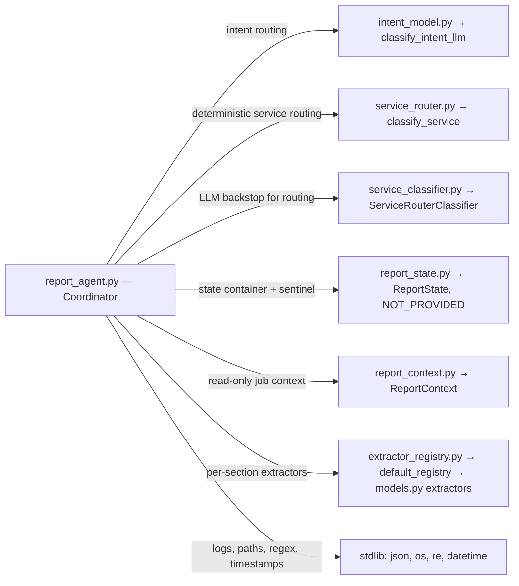

# Arborist Report Assistant — Project Status (Orientation Doc)

## 1) Goal & Purpose

Build a reliable report-building assistant for arborists that:

* **Captures structured facts** from free-text (“Provide Statement” path).
* **Routes service requests** (“Request Service”) to the right downstream agent (section summaries, quick overall summary, report draft, corrections).
* **Keeps context safe** (arborist/customer/location are read-only) and **logs** every turn for traceability.

Success means the Coordinator can take one user turn, make the right routing choice, extract data when appropriate, merge it into a canonical state with provenance, and write a stable log entry—deterministically in tests and robustly in live runs.

---

## 2) Architecture (What lives where)

### **Coordinator (`report_agent.py`)**

* Top-level orchestrator: intent → routing → segmentation → extractor calls → state merge → provenance → logging.
* Cursor-first routing with **explicit-scope overrides** (multi-scope turns supported).
* **Context-edit deflection:** blocks edits to arborist/customer/location/lat-lon.
* **Service routing:** deterministic classifier first, then optional **LLM backstop**.

##### What `report_agent.py` imports and why

* **`classify_intent_llm` from `intent_model.py`** — Step 1 in every turn: classify the user’s message as `PROVIDE_STATEMENT` vs `REQUEST_SERVICE`. The import appears at the top of `report_agent.py`, and the doc for `classify_intent_llm` shows it returns one of the two labels for routing the turn. &#x20;

* **`classify_service` from `service_router.py`** — Deterministic router used first in the `REQUEST_SERVICE` path to map a request to `(service, section?)` without calling an LLM. The function returns one of `MAKE_CORRECTION`, `SECTION_SUMMARY`, `QUICK_SUMMARY`, `MAKE_REPORT_DRAFT`, or `NONE`. In `report_agent.py` it’s used before the LLM backstop.  &#x20;

* **`ServiceRouterClassifier` from `service_classifier.py`** — LLM backstop when deterministic routing returns `NONE`. The Coordinator lazily gets the classifier and uses its `classify` method, then checks confidence to decide whether to accept the LLM decision or return a “clarify” envelope.  &#x20;

* **`default_registry` from `extractor_registry.py`** — Supplies per-section extractors (tree\_description, risks, targets, area\_description, recommendations). Coordinator instantiates this registry at startup and calls `get(section)` inside the Provide-Statement pipeline to run the right extractor for each scoped segment.  &#x20;

* **`ReportState` and `NOT_PROVIDED` from `report_state.py`** — The canonical, accumulating state for a report, plus the sentinel used to guard merges. The Coordinator creates a fresh `ReportState`, merges extractor updates with “prefer existing” semantics, and checks provided-ness using the sentinel. (The merge rules append to list fields and emit provenance rows.)  &#x20;

* **`ReportContext` from `report_context.py`** — Read-only “who/where” job info required at construction; the Coordinator logs that context is present and blocks any attempts to edit it via chat.  &#x20;

* **Stdlib: `json`, `os`, `re`, `datetime`, `typing`** —

  * `json`/`os` for structured turn logs and file creation,
  * `datetime` for ISO timestamps,
  * `re` for the context-edit blocker regex,
  * `typing` for type hints across helpers and the class.  &#x20;

##### A slightly deeper look at the two main paths

* **Provide-Statement path** (extract data into state): Coordinator parses explicit scopes (e.g., “Targets: …; Risks: …”), fetches the matching extractor from the registry, and merges any updates into `ReportState` with provenance; if a segment produced no values, it records `Not Found`.  &#x20;

* **Request-Service path** (route actions): First try the deterministic `classify_service`, then (only if `NONE`) fall back to the LLM classifier; low confidence yields a clarify response.&#x20;

**Extractors & Registry (`extractor_registry.py`, `extractors/*`)**

* One extractor per report section; return strict envelopes (`{"updates": {...}}`) for merges.

### **State & Provenance (`report_state.py`)**

* Canonical `ReportState` with Pydantic models per section.
* **List fields** (e.g., narratives, defects) are **`List[str]`** so new inputs **append** rather than overwrite. Confirmed by tests (accumulation over multiple turns).
* `model_merge_updates(...)`: “prefer\_existing” semantics, provenance events (section, path, value, segment text, extractor, timestamp).

### **Intent & Service Routing**

* **Intent LLM (`intent_llm.py`)**: `PROVIDE_STATEMENT` vs `REQUEST_SERVICE`.
* **Deterministic service router (`service_router.py`)**: maps phrasings to `SECTION_SUMMARY`, `QUICK_SUMMARY`, `MAKE_REPORT_DRAFT`, `MAKE_CORRECTION`, or `NONE`.
* **LLM backstop (`service_classifier.py`)**: structured classifier (service, optional section, confidence). Factory seam (`.get`) used in tests.

### **Context (`report_context.py`)**

* Read-only arborist/customer/location supplied to summaries/drafts; never edited via chat.

**Models & Schemas (`models.py`)**

* Strict, Pydantic-typed envelopes (`extra="forbid"`) and sentinel `NOT_PROVIDED`.

### **Logging**

* Human-readable log blocks to `coordinator_logs/coordinator-tests.txt`: context load + every turn (intent, routing, result, errors).

---

## 3) Package Dependencies

* **Pydantic** — state & envelopes (strict validation).
* **OpenAI** — LLM backend (e.g., `gpt-4o-mini`) for live runs.
* **Outlines/structured calling** — where applicable for extractors/classifiers.
* **pytest** — unit, integration, full tests.
* **python-dotenv** — load env in full tests.
* **Stdlib** — `json`, `datetime`, `typing`, `re`, etc.

---

## 4) Sprints / Phases & What We Delivered

### Phase A — Coordinator v2 & Safety Rails

* Cursor-first routing with **explicit-scope parsing** (multi-scope per turn).
* Context-edit **blocker** (customer/arborist/location/lat/lon).
* Provenance events attached per applied path.
* **Logging** finalized (TURN blocks + context load).

### Phase B — State Semantics & Normal Forms

* **List fields** for non-overwriting data (e.g., `defects`, narratives): converted to `List[str]` so multiple turns **append**. Confirmed by tests (accumulation).
* “Prefer existing” merge policy: incoming `NOT_PROVIDED` cannot clobber provided state.

### Phase C — Deterministic Router + LLM Backstop Seam

* Deterministic service classifier integrated (SECTION\_SUMMARY, QUICK\_SUMMARY, MAKE\_REPORT\_DRAFT, MAKE\_CORRECTION).
* LLM backstop contract defined (service, optional section, confidence; `.get` seam for tests).

### Phase D — Test Harnesses & Coverage (what we actually ran)

**Unit**

* `tests/unit/test_context_block.py` — blocks context edits; negative controls pass (similar words that aren’t edits).
* (More unit files exist per earlier plan: segmentation, state merge, deterministic router, backstop contract, minimal intent classifier.)
  *Note:* The big value came from the integrations + full tests; we kept unit tests lean.

**Integration**

* `tests/integrations/test_pipeline_provide_statement.py` — end-to-end with stubbed extractors; multi-scope segmentation; merges; provenance; navigation-only; no-capture.
* `tests/integrations/test_pipeline_request_service.py` — deterministic routing to stubs; LLM backstop seam (monkeypatched).
* `tests/integrations/test_logging_stability.py` — file grows across turns; each block parses as JSON; headers consistent.

**Full (live)**

* `tests/full/test_provide_statement_llm.py` — **live extractors + intent**, multi-scope, lead-in+scope, navigation-only, no-capture (clarify), list accumulation, prefer-existing, noisy numeric capture, three-scope turn.
  ✅ **13/13 passing** and **logs written** to `coordinator_logs/coordinator-tests.txt` (verified).
* `tests/full/test_request_services_llm.py` — service path with deterministic classifier; LLM backstop cases.
  *Status:* deterministic branch validated; LLM backstop tests use a monkeypatch seam (`.get`) to avoid hard dependency on live LLM. (We keep a simple smoke option if we want a non-CI run.)

What this means: the **Provide Statement pipeline is flushed end-to-end** with the real extractors and intent; the **Request Service** routing is verified at the envelope level (deterministic) and via a controlled backstop seam.

---

## 5) Testing Strategy (Summary)

**Context & Forbidden Fields**

* Unit: phrases that should/shouldn’t be blocked; assert `routed_to="blocked_context_edit"`, no state mutation.
* Integration: mixed phrases through Coordinator; confirm blocks and log entries.

**Intent Classification & Routing**

* Param tests for clear PROVIDE vs REQUEST; boundary language to ensure `REQUEST_SERVICE` triggers.

**Provide Statement Path**

* **Segmentation parser** unit tests for: single scope, multiple scopes, lead-in, trailing empty scope (navigation-only).
* **State merge** unit tests for: scalars vs lists (append), ignoring `NOT_PROVIDED`, single “Not Found” provenance when nothing applied, prefer-existing behavior.
* **Integration**: height/dbh/defects → applied; corrections; navigation-only; no-capture; provenance count & content.
* **Error handling**: extractor raises → `ok=False`, logged TURN.

**Request Service Path**

* Deterministic router unit tests: explicit phrases per service; section inference when included.
* LLM backstop unit tests (mocked): high vs low confidence; clarify path; deterministic short-circuit (backstop not called).
* Integration: Coordinator returns correct `(service, section)`; state stays unchanged; routing string shows backstop when used.

**Logging**

* Stability test: file growth per turn; valid JSON blocks; expected keys; correct `routed_to` strings.

**Determinism & Speed**

* Temperature 0; mock LLMs in unit/integration; run **live** only in targeted “full” suites.

---

## 6) Next Moves (Conversation Flow & Service Agents)

**Conversation Flow**

* Wrap Coordinator in a turn loop (prompting, confirmations, follow-ups).
* Clarify prompts when `note="no_capture"` (already surfaced in envelopes) and when backstop confidence is low.

**Service Agents**

* **Section summary** agent (deterministic sections + context).
* **Quick summary** agent (whole-report snapshot).
* **Report draft** agent scaffold (uses context + state; includes provenance-aware language if fields are missing).
* **Make correction** path (service) that triggers the appropriate extractor/section and emits confirmations.

**Extractor & State Enhancements**

* **Risk parsing policy**: bias to `description` unless explicit labels present.
* Normalization pass (units, quotes, spacing) post-merge.
* Formalize append vs replace policies per list field (risks/targets lists already append; confirm all).

**Infra**

* Add **coverage** (pytest-cov) and a badge.
* CI gating: unit + integration (stubbed). Keep “full” suites optional/manual or nightly.

---

### TL;DR

* Coordinator + Provide Statement pipeline are **solid** and **fully exercised** with live extractors and logging.
* Request Service path is **functionally routed**; deterministic cases verified; LLM backstop handled via a seam in tests.
* State model uses **lists for narratives/defects/etc.** so we **accumulate**; tests confirm.
* We’re ready to build the **conversation layer** and wire up **summary/report/correction** agents on top of this foundation.

# Project Update — 2025-08-31

## What shipped since the last update

* **Coordinator rename & hygiene**

  * `report_agent.py` → `coordinator_agent.py` (imports and tests aligned).
  * Logging path normalized (`coordinator_logs/coordinator-tests.txt`), safer writes in tests.

* **Context-edit safety (completed as planned)**

  * Blocker now guards **arborist info**, **customer info**, and **tree GPS** (lat/lon).
  * Unit coverage expanded with precise positives/negatives; false positives reduced.

* **Segmentation (completed & hardened)**

  * Explicit multi-scope parsing (“Targets: …; Risks: …”) and **cursor-first fallback** when no scope is found.
  * Unit test fixed to assert the fallback behavior explicitly.

* **Deterministic service router (completed as planned)**

  * Larger param suite for `MAKE_CORRECTION`, `SECTION_SUMMARY`, `QUICK_SUMMARY`, `MAKE_REPORT_DRAFT`, `NONE`.
  * “overview / recap / TL;DR” phrasing now exercised.

* **LLM backstop seam (completed w/ tests)**

  * `ServiceRouterClassifier` used **only when** deterministic router returns `NONE`.
  * Tests verify: high-confidence accept, low-confidence clarify, exception path captured & reported.

* **State & provenance (completed + improvement)**

  * `ReportState.model_merge_updates`:

    * **Append** for list fields; **last-write** for scalars (or **prefer-existing**).
    * Emits one **“Not Found”** provenance row per segment when nothing is applied.
    * **New:** On **scalar corrections** with `policy="last_write"`, we **de-duplicate** prior provenance rows for the same `section.path`, keeping only the latest (fix validated by unit test).

* **Corrections Agent (new)**

  * `corrections_agent.CorrectionsAgent` implemented as a **single-scope** correction runner:

    * Selects the extractor by **section** and runs it on the given **text**.
    * Returns a normalized `updates` envelope and `applied` flag; **does not mutate state**.
  * Unit tests verify:

    * Correct extractor is called with the right payload.
    * Returned updates, when merged with `policy="last_write"`, overwrite state and preserve scalar provenance de-dup.
    * Empty updates → one “Not Found” provenance row on merge.
    * Agent **does not** call the deterministic router.
    * Response contract shape is stable.

* **Intent classifier unit (completed)**

  * Tests cover binary routing (`PROVIDE_STATEMENT` vs `REQUEST_SERVICE`) with typical cues; minimal, fast mock retained.

## Test suite status (high-level)

* **Unit**: context blocker, segmentation, deterministic router, state merge (incl. de-dup), intent classifier, corrections agent — **green**.
* **Integrations**: provide-statement and request-service pipelines with stubs + logging stability — **green**.
* **Full (live)**: provide-statement with real extractors & intent; request-service with deterministic + mocked backstop — **green** for targeted scenarios.

## Changes that may affect developers

* Use `coordinator_agent.Coordinator` (not `report_agent`).
* `ReportState.model_merge_updates` now removes older scalar provenance rows on `policy="last_write"`; this improves audit clarity for corrections.
* Corrections are **single-scope per call**; multi-section corrections are achieved by **multiple agent calls** and merges.

## Open items & notes

* Coordinator’s request-service branch: confirm (and keep tests enforcing) the order:

  1. **Deterministic** router,
  2. **LLM backstop** if `NONE`,
  3. **Clarify** only if backstop confidence is low or still `NONE`.
* Section summary / quick summary / report draft agents: scaffolds exist conceptually; production logic and prompts to implement.
* Style/format: You changed report section order and “Editor Comment” notes — ensure downstream report agents output **exact H2s** and the **omissions note** per your spec.

---

## Roadmap to the Conversational Agent

### 1) Turn loop + UX glue (Sprint 1)

* Wrap `Coordinator.handle_turn` in a lightweight dialog manager:

  * **Echo-back confirmations** for captured fields (per section).
  * **Clarify prompts** when `note="no_capture"` or backstop low-confidence.
  * **Safe navigation** commands (“Go to Risks”, “Switch to Targets”) that only change cursor.

**Exit criteria:** deterministic demos of 1–2 turns with captures, a clarify loop, and a correction applied.

### 2) Service agents (Sprint 2)

* **Section Summary Agent**

  * Inputs: `SectionSummaryInputs.make(...)` snapshot + context.
  * Output: replace-on-write `summaries.<section>.text` + single provenance row (already supported).
* **Quick Summary Agent**

  * Whole-report snapshot; bias to provided paths; short, section-tagged.
* **Report Draft Agent**

  * Full draft using state + context; adheres to your **Markdown H2 order** and **“Editor Comment / omissions”** rule.
  * Zero unit conversion; use units verbatim from state.

**Exit criteria:** Coordinator can route to any of the three service agents and persist outputs with provenance.

### 3) Corrections flow (Sprint 3)

* Integrate `CorrectionsAgent` in the request-service branch for `MAKE_CORRECTION`.
* Add short confirmation UX after merge (e.g., “Updated `tree_description.dbh_in` to 30”).

**Exit criteria:** Multi-step conversation: capture → summary → correction → re-summary, all logged, reproducible in tests.

### 4) Robustness & polish (Sprint 4)

* **Normalization filters** (spacing/quotes; *no* unit conversion) post-merge.
* **Risk/target list handling**: smart matching on corrections (edit vs. append heuristics).
* **CI**: add `pytest-cov`, badge, and default gates on **unit+integration**; keep “full” optional.

**Exit criteria:** >85% line coverage on coordinator/state/routers; nightly “full” green.

### 5) Field rollout prep (Sprint 5)

* **Operator guide** (how to read logs, how to reproduce a run).
* **Error budget** & fallbacks (graceful messages when LLMs are unavailable).
* **Prompt library** versioning for service agents.

**Exit criteria:** runnable demo session + doc set; clear rollback knobs.

---

## Risks & mitigations

* **Classifier drift** (LLM backstop): keep deterministic router strong; backstop threshold configurable and tested.
* **Over-blocking context edits**: unit tests already guard false positives; keep regex narrow.
* **Provenance bloat**: scalar de-dup implemented; keep an eye on list paths (intended to accumulate).
* **Spec churn (report format)**: lock H2 order + omissions note in tests for section/report agents.

---

## Completed items from prior plan

* Coordinator rename, logging stabilization ✅
* Context-edit blockade with expanded coverage ✅
* Segmentation with cursor-first fallback ✅
* Deterministic service router + expanded phrase coverage ✅
* LLM backstop seam + tests (high/low/exception) ✅
* `ReportState` merge semantics + **provenance de-dup for scalar corrections** ✅
* Corrections Agent + unit tests (single-scope, contract, “Not Found” path) ✅

---

**TL;DR:**
Core plumbing is solid: safe context, reliable segmentation, deterministic routing with a tested LLM backstop, and a provenance-rich state model. Corrections Agent is in place. Next up: wire the **conversation loop** and ship the **summary/draft** agents with your exact formatting rules.
