# Arborist Report Assistant — Project Status (Orientation Doc)

## 1) Goal & Purpose

Build a reliable report-building assistant for arborists that:

* **Captures structured facts** from free-text (“Provide Statement” path).
* **Routes service requests** (“Request Service”) to the right downstream agent (section summaries, quick overall summary, report draft, corrections).
* **Keeps context safe** (arborist/customer/location are read-only) and **logs** every turn for traceability.

Success means the Coordinator can take one user turn, make the right routing choice, extract data when appropriate, merge it into a canonical state with provenance, and write a stable log entry—deterministically in tests and robustly in live runs.

---

## 2) Architecture (What lives where)

```mermaid
graph LR
  A[report_agent.py — Coordinator] -->|intent routing| B[intent_model.py → classify_intent_llm]
  A -->|deterministic service routing| C[service_router.py → classify_service]
  A -->|LLM backstop for routing| D[service_classifier.py → ServiceRouterClassifier]
  A -->|state container + sentinel| E[report_state.py → ReportState, NOT_PROVIDED]
  A -->|read-only job context| F[report_context.py → ReportContext]
  A -->|per-section extractors| G[extractor_registry.py → default_registry → models.py extractors]
  A -->|logs, paths, regex, timestamps| H[stdlib: json, os, re, datetime]
```


### **Coordinator (`report_agent.py`)**

* Top-level orchestrator: intent → routing → segmentation → extractor calls → state merge → provenance → logging.
* Cursor-first routing with **explicit-scope overrides** (multi-scope turns supported).
* **Context-edit deflection:** blocks edits to arborist/customer/location/lat-lon.
* **Service routing:** deterministic classifier first, then optional **LLM backstop**.

##### What `report_agent.py` imports and why

* **`classify_intent_llm` from `intent_model.py`** — Step 1 in every turn: classify the user’s message as `PROVIDE_STATEMENT` vs `REQUEST_SERVICE`. The import appears at the top of `report_agent.py`, and the doc for `classify_intent_llm` shows it returns one of the two labels for routing the turn.  

* **`classify_service` from `service_router.py`** — Deterministic router used first in the `REQUEST_SERVICE` path to map a request to `(service, section?)` without calling an LLM. The function returns one of `MAKE_CORRECTION`, `SECTION_SUMMARY`, `QUICK_SUMMARY`, `MAKE_REPORT_DRAFT`, or `NONE`. In `report_agent.py` it’s used before the LLM backstop.   

* **`ServiceRouterClassifier` from `service_classifier.py`** — LLM backstop when deterministic routing returns `NONE`. The Coordinator lazily gets the classifier and uses its `classify` method, then checks confidence to decide whether to accept the LLM decision or return a “clarify†envelope.   

* **`default_registry` from `extractor_registry.py`** — Supplies per-section extractors (tree\_description, risks, targets, area\_description, recommendations). Coordinator instantiates this registry at startup and calls `get(section)` inside the Provide-Statement pipeline to run the right extractor for each scoped segment.   

* **`ReportState` and `NOT_PROVIDED` from `report_state.py`** — The canonical, accumulating state for a report, plus the sentinel used to guard merges. The Coordinator creates a fresh `ReportState`, merges extractor updates with “prefer existing†semantics, and checks provided-ness using the sentinel. (The merge rules append to list fields and emit provenance rows.)   

* **`ReportContext` from `report_context.py`** — Read-only “who/where†job info required at construction; the Coordinator logs that context is present and blocks any attempts to edit it via chat.   

* **Stdlib: `json`, `os`, `re`, `datetime`, `typing`** —

  * `json`/`os` for structured turn logs and file creation,
  * `datetime` for ISO timestamps,
  * `re` for the context-edit blocker regex,
  * `typing` for type hints across helpers and the class.   

##### A slightly deeper look at the two main paths

* **Provide-Statement path** (extract data into state): Coordinator parses explicit scopes (e.g., “Targets: …; Risks: …”), fetches the matching extractor from the registry, and merges any updates into `ReportState` with provenance; if a segment produced no values, it records `Not Found`.   

* **Request-Service path** (route actions): First try the deterministic `classify_service`, then (only if `NONE`) fall back to the LLM classifier; low confidence yields a clarify response. 

**Extractors & Registry (`extractor_registry.py`, `extractors/*`)**

* One extractor per report section; return strict envelopes (`{"updates": {...}}`) for merges.

### **State & Provenance (`report_state.py`)**

* Canonical `ReportState` with Pydantic models per section.
* **List fields** (e.g., narratives, defects) are **`List[str]`** so new inputs **append** rather than overwrite. Confirmed by tests (accumulation over multiple turns).
* `model_merge_updates(...)`: “prefer\_existing” semantics, provenance events (section, path, value, segment text, extractor, timestamp).

### **Intent & Service Routing**

* **Intent LLM (`intent_llm.py`)**: `PROVIDE_STATEMENT` vs `REQUEST_SERVICE`.
* **Deterministic service router (`service_router.py`)**: maps phrasings to `SECTION_SUMMARY`, `QUICK_SUMMARY`, `MAKE_REPORT_DRAFT`, `MAKE_CORRECTION`, or `NONE`.
* **LLM backstop (`service_classifier.py`)**: structured classifier (service, optional section, confidence). Factory seam (`.get`) used in tests.

### **Context (`report_context.py`)**

* Read-only arborist/customer/location supplied to summaries/drafts; never edited via chat.

**Models & Schemas (`models.py`)**

* Strict, Pydantic-typed envelopes (`extra="forbid"`) and sentinel `NOT_PROVIDED`.

### **Logging**

* Human-readable log blocks to `coordinator_logs/coordinator-tests.txt`: context load + every turn (intent, routing, result, errors).

---

## 3) Package Dependencies

* **Pydantic** — state & envelopes (strict validation).
* **OpenAI** — LLM backend (e.g., `gpt-4o-mini`) for live runs.
* **Outlines/structured calling** — where applicable for extractors/classifiers.
* **pytest** — unit, integration, full tests.
* **python-dotenv** — load env in full tests.
* **Stdlib** — `json`, `datetime`, `typing`, `re`, etc.

---

## 4) Sprints / Phases & What We Delivered

### Phase A — Coordinator v2 & Safety Rails

* Cursor-first routing with **explicit-scope parsing** (multi-scope per turn).
* Context-edit **blocker** (customer/arborist/location/lat/lon).
* Provenance events attached per applied path.
* **Logging** finalized (TURN blocks + context load).

### Phase B — State Semantics & Normal Forms

* **List fields** for non-overwriting data (e.g., `defects`, narratives): converted to `List[str]` so multiple turns **append**. Confirmed by tests (accumulation).
* “Prefer existing” merge policy: incoming `NOT_PROVIDED` cannot clobber provided state.

### Phase C — Deterministic Router + LLM Backstop Seam

* Deterministic service classifier integrated (SECTION\_SUMMARY, QUICK\_SUMMARY, MAKE\_REPORT\_DRAFT, MAKE\_CORRECTION).
* LLM backstop contract defined (service, optional section, confidence; `.get` seam for tests).

### Phase D — Test Harnesses & Coverage (what we actually ran)

**Unit**

* `tests/unit/test_context_block.py` — blocks context edits; negative controls pass (similar words that aren’t edits).
* (More unit files exist per earlier plan: segmentation, state merge, deterministic router, backstop contract, minimal intent classifier.)
  *Note:* The big value came from the integrations + full tests; we kept unit tests lean.

**Integration**

* `tests/integrations/test_pipeline_provide_statement.py` — end-to-end with stubbed extractors; multi-scope segmentation; merges; provenance; navigation-only; no-capture.
* `tests/integrations/test_pipeline_request_service.py` — deterministic routing to stubs; LLM backstop seam (monkeypatched).
* `tests/integrations/test_logging_stability.py` — file grows across turns; each block parses as JSON; headers consistent.

**Full (live)**

* `tests/full/test_provide_statement_llm.py` — **live extractors + intent**, multi-scope, lead-in+scope, navigation-only, no-capture (clarify), list accumulation, prefer-existing, noisy numeric capture, three-scope turn.
  ✅ **13/13 passing** and **logs written** to `coordinator_logs/coordinator-tests.txt` (verified).
* `tests/full/test_request_services_llm.py` — service path with deterministic classifier; LLM backstop cases.
  *Status:* deterministic branch validated; LLM backstop tests use a monkeypatch seam (`.get`) to avoid hard dependency on live LLM. (We keep a simple smoke option if we want a non-CI run.)

What this means: the **Provide Statement pipeline is flushed end-to-end** with the real extractors and intent; the **Request Service** routing is verified at the envelope level (deterministic) and via a controlled backstop seam.

---

## 5) Testing Strategy (Summary)

**Context & Forbidden Fields**

* Unit: phrases that should/shouldn’t be blocked; assert `routed_to="blocked_context_edit"`, no state mutation.
* Integration: mixed phrases through Coordinator; confirm blocks and log entries.

**Intent Classification & Routing**

* Param tests for clear PROVIDE vs REQUEST; boundary language to ensure `REQUEST_SERVICE` triggers.

**Provide Statement Path**

* **Segmentation parser** unit tests for: single scope, multiple scopes, lead-in, trailing empty scope (navigation-only).
* **State merge** unit tests for: scalars vs lists (append), ignoring `NOT_PROVIDED`, single “Not Found” provenance when nothing applied, prefer-existing behavior.
* **Integration**: height/dbh/defects → applied; corrections; navigation-only; no-capture; provenance count & content.
* **Error handling**: extractor raises → `ok=False`, logged TURN.

**Request Service Path**

* Deterministic router unit tests: explicit phrases per service; section inference when included.
* LLM backstop unit tests (mocked): high vs low confidence; clarify path; deterministic short-circuit (backstop not called).
* Integration: Coordinator returns correct `(service, section)`; state stays unchanged; routing string shows backstop when used.

**Logging**

* Stability test: file growth per turn; valid JSON blocks; expected keys; correct `routed_to` strings.

**Determinism & Speed**

* Temperature 0; mock LLMs in unit/integration; run **live** only in targeted “full” suites.

---

## 6) Next Moves (Conversation Flow & Service Agents)

**Conversation Flow**

* Wrap Coordinator in a turn loop (prompting, confirmations, follow-ups).
* Clarify prompts when `note="no_capture"` (already surfaced in envelopes) and when backstop confidence is low.

**Service Agents**

* **Section summary** agent (deterministic sections + context).
* **Quick summary** agent (whole-report snapshot).
* **Report draft** agent scaffold (uses context + state; includes provenance-aware language if fields are missing).
* **Make correction** path (service) that triggers the appropriate extractor/section and emits confirmations.

**Extractor & State Enhancements**

* **Risk parsing policy**: bias to `description` unless explicit labels present.
* Normalization pass (units, quotes, spacing) post-merge.
* Formalize append vs replace policies per list field (risks/targets lists already append; confirm all).

**Infra**

* Add **coverage** (pytest-cov) and a badge.
* CI gating: unit + integration (stubbed). Keep “full” suites optional/manual or nightly.

---

### TL;DR

* Coordinator + Provide Statement pipeline are **solid** and **fully exercised** with live extractors and logging.
* Request Service path is **functionally routed**; deterministic cases verified; LLM backstop handled via a seam in tests.
* State model uses **lists for narratives/defects/etc.** so we **accumulate**; tests confirm.
* We’re ready to build the **conversation layer** and wire up **summary/report/correction** agents on top of this foundation.

# Project Update — 2025-08-31

## What shipped since the last update

* **Coordinator rename & hygiene**

  * `report_agent.py` → `coordinator_agent.py` (imports and tests aligned).
  * Logging path normalized (`coordinator_logs/coordinator-tests.txt`), safer writes in tests.

* **Context-edit safety (completed as planned)**

  * Blocker now guards **arborist info**, **customer info**, and **tree GPS** (lat/lon).
  * Unit coverage expanded with precise positives/negatives; false positives reduced.

* **Segmentation (completed & hardened)**

  * Explicit multi-scope parsing (“Targets: …; Risks: …”) and **cursor-first fallback** when no scope is found.
  * Unit test fixed to assert the fallback behavior explicitly.

* **Deterministic service router (completed as planned)**

  * Larger param suite for `MAKE_CORRECTION`, `SECTION_SUMMARY`, `QUICK_SUMMARY`, `MAKE_REPORT_DRAFT`, `NONE`.
  * “overview / recap / TL;DR” phrasing now exercised.

* **LLM backstop seam (completed w/ tests)**

  * `ServiceRouterClassifier` used **only when** deterministic router returns `NONE`.
  * Tests verify: high-confidence accept, low-confidence clarify, exception path captured & reported.

* **State & provenance (completed + improvement)**

  * `ReportState.model_merge_updates`:

    * **Append** for list fields; **last-write** for scalars (or **prefer-existing**).
    * Emits one **“Not Found”** provenance row per segment when nothing is applied.
    * **New:** On **scalar corrections** with `policy="last_write"`, we **de-duplicate** prior provenance rows for the same `section.path`, keeping only the latest (fix validated by unit test).

* **Corrections Agent (new)**

  * `corrections_agent.CorrectionsAgent` implemented as a **single-scope** correction runner:

    * Selects the extractor by **section** and runs it on the given **text**.
    * Returns a normalized `updates` envelope and `applied` flag; **does not mutate state**.
  * Unit tests verify:

    * Correct extractor is called with the right payload.
    * Returned updates, when merged with `policy="last_write"`, overwrite state and preserve scalar provenance de-dup.
    * Empty updates → one “Not Found” provenance row on merge.
    * Agent **does not** call the deterministic router.
    * Response contract shape is stable.

* **Intent classifier unit (completed)**

  * Tests cover binary routing (`PROVIDE_STATEMENT` vs `REQUEST_SERVICE`) with typical cues; minimal, fast mock retained.

## Test suite status (high-level)

* **Unit**: context blocker, segmentation, deterministic router, state merge (incl. de-dup), intent classifier, corrections agent — **green**.
* **Integrations**: provide-statement and request-service pipelines with stubs + logging stability — **green**.
* **Full (live)**: provide-statement with real extractors & intent; request-service with deterministic + mocked backstop — **green** for targeted scenarios.

## Changes that may affect developers

* Use `coordinator_agent.Coordinator` (not `report_agent`).
* `ReportState.model_merge_updates` now removes older scalar provenance rows on `policy="last_write"`; this improves audit clarity for corrections.
* Corrections are **single-scope per call**; multi-section corrections are achieved by **multiple agent calls** and merges.

## Open items & notes

* Coordinator’s request-service branch: confirm (and keep tests enforcing) the order:

  1. **Deterministic** router,
  2. **LLM backstop** if `NONE`,
  3. **Clarify** only if backstop confidence is low or still `NONE`.
* Section summary / quick summary / report draft agents: scaffolds exist conceptually; production logic and prompts to implement.
* Style/format: You changed report section order and “Editor Comment” notes — ensure downstream report agents output **exact H2s** and the **omissions note** per your spec.

---

## Roadmap to the Conversational Agent

### 1) Turn loop + UX glue (Sprint 1)

* Wrap `Coordinator.handle_turn` in a lightweight dialog manager:

  * **Echo-back confirmations** for captured fields (per section).
  * **Clarify prompts** when `note="no_capture"` or backstop low-confidence.
  * **Safe navigation** commands (“Go to Risks”, “Switch to Targets”) that only change cursor.

**Exit criteria:** deterministic demos of 1–2 turns with captures, a clarify loop, and a correction applied.

### 2) Service agents (Sprint 2)

* **Section Summary Agent**

  * Inputs: `SectionSummaryInputs.make(...)` snapshot + context.
  * Output: replace-on-write `summaries.<section>.text` + single provenance row (already supported).
* **Quick Summary Agent**

  * Whole-report snapshot; bias to provided paths; short, section-tagged.
* **Report Draft Agent**

  * Full draft using state + context; adheres to your **Markdown H2 order** and **“Editor Comment / omissions”** rule.
  * Zero unit conversion; use units verbatim from state.

**Exit criteria:** Coordinator can route to any of the three service agents and persist outputs with provenance.

### 3) Corrections flow (Sprint 3)

* Integrate `CorrectionsAgent` in the request-service branch for `MAKE_CORRECTION`.
* Add short confirmation UX after merge (e.g., “Updated `tree_description.dbh_in` to 30”).

**Exit criteria:** Multi-step conversation: capture → summary → correction → re-summary, all logged, reproducible in tests.

### 4) Robustness & polish (Sprint 4)

* **Normalization filters** (spacing/quotes; *no* unit conversion) post-merge.
* **Risk/target list handling**: smart matching on corrections (edit vs. append heuristics).
* **CI**: add `pytest-cov`, badge, and default gates on **unit+integration**; keep “full” optional.

**Exit criteria:** >85% line coverage on coordinator/state/routers; nightly “full” green.

### 5) Field rollout prep (Sprint 5)

* **Operator guide** (how to read logs, how to reproduce a run).
* **Error budget** & fallbacks (graceful messages when LLMs are unavailable).
* **Prompt library** versioning for service agents.

**Exit criteria:** runnable demo session + doc set; clear rollback knobs.

---

## Risks & mitigations

* **Classifier drift** (LLM backstop): keep deterministic router strong; backstop threshold configurable and tested.
* **Over-blocking context edits**: unit tests already guard false positives; keep regex narrow.
* **Provenance bloat**: scalar de-dup implemented; keep an eye on list paths (intended to accumulate).
* **Spec churn (report format)**: lock H2 order + omissions note in tests for section/report agents.

---

## Completed items from prior plan

* Coordinator rename, logging stabilization ✅
* Context-edit blockade with expanded coverage ✅
* Segmentation with cursor-first fallback ✅
* Deterministic service router + expanded phrase coverage ✅
* LLM backstop seam + tests (high/low/exception) ✅
* `ReportState` merge semantics + **provenance de-dup for scalar corrections** ✅
* Corrections Agent + unit tests (single-scope, contract, “Not Found” path) ✅

---

**TL;DR:**
Core plumbing is solid: safe context, reliable segmentation, deterministic routing with a tested LLM backstop, and a provenance-rich state model. Corrections Agent is in place. Next up: wire the **conversation loop** and ship the **summary/draft** agents with your exact formatting rules.

# Project Update — 2025-09-03

## What we shipped (since the last checkpoint)

* **Routing accuracy (live) test in place and passing**

  * Uses `tests/TEST_CORPUS.py` (normalized tuples/dicts), deterministic sampling, and logs per-row outcomes to `coordinator_logs/coordinator-tests.txt`.
  * Deterministic router runs first; LLM backstop only on `NONE`. Current sample run: 96 deterministic hits / 4 backstop calls; **service & joint accuracy 1.00** on that set.
  * Schema/contract fixes made so the backstop returns **`{"result": {"service","section","confidence"}}`** and *section is required-but-nullable*.

* **`service_classifier.py` fully corrected & stabilized**

  * Canonical Outlines call: **prompt-first + `output_type=<Pydantic schema>`**.
  * Removed double-nest bug (`{"result":{"result":...}}`), added strict schema, flattened return.
  * Prompt policy now treats **“outline”** explicitly (OUTLINE or SECTION\_SUMMARY+section); generic “summary/recap/overview” without a section → **NONE** (clarify).

* **Coordinator service path wired to agents (design complete)**

  * Proposed REQUEST\_SERVICE branch:

    * `SECTION_SUMMARY` → `SectionReportAgent` (**prose** mode)
    * `OUTLINE` → `SectionReportAgent` (**outline** mode)
    * `MAKE_CORRECTION` → `CorrectionsAgent` (extract → **merge** if anything provided)
    * `MAKE_REPORT_DRAFT` → `ReportAgent` (full draft; returns markdown + token usage)
  * No hidden state writes except **corrections** (merge with provenance).

* **Corrections & section/report agents**

  * `CorrectionsAgent`: single-scope correction runner that returns normalized `updates` + `applied` flag.
  * `SectionReportAgent`: prose/outline/payload modes; payload is deterministic and inspectable; prose path via LangChain `ChatOpenAI`.
  * `ReportAgent`: produces the initial full **Markdown** draft with the required H2 order and an **“Editor Comment”** line per section.

* **Logging & test ergonomics**

  * Routing eval test writes structured JSON lines (phrase, expected, predicted, route path, pass/fail, summary).
  * Conftest integration done so logs consistently land in `coordinator_logs/coordinator-tests.txt`.

---

## What’s left to do (functional)

1. **Finalize Coordinator→Agent integration**

   * Apply the provided REQUEST\_SERVICE patch (if not already) so live runs actually call:

     * `SectionReportAgent` (summary/outline),
     * `CorrectionsAgent` (and then merge),
     * `ReportAgent` (draft).
   * Decide persistence for section summaries/drafts:

     * Where to store: `state.summaries.<section>.text` (summary) and a `state.report.draft_text` (draft) + provenance rows.

2. **End-to-end live tests (agent outputs)**

   * **SectionReportAgent (outline):** deterministic assertions on “`field_path: value`” lines from a seeded `ReportState`.
   * **SectionReportAgent (prose):** run with `FakeChatModel` and assert payload structure/tokens; add a single “live” smoke if desired.
   * **ReportAgent (draft):** assert all five H2s in order and presence of “Editor Comment:” per section; verify `[section-pN]` IDs.

3. **Clarify loop behavior**

   * When routing returns **CLARIFY** or Provide-Statement yields **no\_capture**, surface a consistent short prompt to the user.
   * Minimal dialog glue (one extra turn) around the Coordinator.

4. **Backstop confidence policy**

   * Threshold currently **0.60** (as used in examples). Confirm and codify via env (e.g., `ROUTING_BACKSTOP_MIN_CONF=0.6`) and test both sides of the gate.

---

## Non-breaking issues to address

* **Pytest mark warning**
  Register the custom mark to silence `PytestUnknownMarkWarning`:

  ```
  # pytest.ini
  [pytest]
  markers =
      live: runs tests that hit live LLMs (opt-in via RUN_LIVE=1)
  ```

* **Classifier accessor parity**
  Coordinator examples use `ServiceRouterClassifier.get()`. Ensure the class provides a `@staticmethod get()` returning a singleton **or** switch calls to `ServiceRouterClassifier()` everywhere. (The test currently instantiates directly.)

* **Token usage visibility**
  Outlines extractors don’t expose usage; agents return `{"in":0,"out":0}` when unknown. That’s fine for now—just document it in logs/UI.

* **Confidence logging**
  We log confidence for LLM path when provided; deterministic rows show `null`. Harmless, but we may want to coerce to `0.0` for consistency in analytics.

---

## Roadmap to the Conversational Agent

**Sprint 1 — Glue & Clarify**

* Wrap `Coordinator.handle_turn` with a thin loop that:

  * echoes applied corrections (“Updated `tree_description.dbh_in` to 30 in”),
  * asks targeted clarifications when `CLARIFY` or `no_capture`,
  * supports “navigate to <section>” without invoking LLMs.
* Add tests for clarify branches and navigation-only turns.

**Sprint 2 — Service Agents E2E**

* Land the Coordinator patch and persist:

  * section summaries (`state.summaries.<section>.text` + provenance),
  * full report draft (`state.report.draft_text` + provenance).
* Add **structural assertions** tests for `SectionReportAgent` (outline/prose) and `ReportAgent` (H2 order, IDs, editor comments).

**Sprint 3 — Quality & Normalization**

* Post-merge normalization (whitespace, quotes; **no** unit conversion).
* Heuristics around list vs scalar corrections (avoid accidental appends).
* Tighten risk/target phrasing policies where needed.

**Sprint 4 — CI & Observability**

* Add `pytest-cov`, set gates on unit + integration; keep “live” optional via `RUN_LIVE=1`.
* Expand log summaries (counts by route, accuracy deltas over time).

**Sprint 5 — Operator polish**

* Simple operator guide (how to read logs, reproduce runs).
* Error budget & fallbacks (graceful messaging when LLMs are unavailable).
* Prompt versioning for service agents.

---

### TL;DR

* **Routing accuracy live test**: green, logging rich telemetry.
* **Classifier & router**: corrected, schema-true, and aligned with Outlines.
* **Agent wiring**: designed; apply the Coordinator patch to execute summaries/outline/draft/corrections for real.
* Next up: **persist agent outputs**, add **E2E structural tests**, and ship the **clarify loop** for a usable conversation experience.

Got it — here’s a dated project update based on the last sprint’s work, what we accomplished, and how it reshapes the roadmap.

---

# Project Update — 2025-09-04

Project tree for arborist-agent
================================
├── cli.py
├── coordinator_agent.py
├── coordinator_logs
├── corrections_agent.py
├── deprecate
│   └── one_turn_parser.py
├── docs
├── environment.yml
├── extractor_registry.py
├── intent_model.py
├── models.py
├── pings -- Live tests
│   ├── __init__.py
│   ├── corrections_ping.py
│   ├── llm_ping.py
│   ├── ping_corrections_agent.py
│   ├── ping_e2e_sections_and_corrections.py
│   ├── ping_section_agent.py
│   ├── report_ping.py
│   └── section_ping.py
├── print_dir.py
├── report_agent.py
├── report_context.py
├── report_state.py
├── section_report_agent.py
├── service_classifier.py
├── service_router.py
└── tests
    ├── TEST_CHALLENGE.py
    ├── TEST_CORPUS.py
    ├── __init__.py
    ├── conftest.py
    ├── eval
    │   └── test_service_routing_accuracy.py
    ├── full
    │   ├── conftest.py
    │   ├── test_provide_statement_llm.py
    │   └── test_request_services_llm.py
    ├── integrations
    │   ├── test_logging_stability.py
    │   ├── test_pipeline_provide_statement.py
    │   └── test_pipeline_request_service.py
    ├── router_test.py
    ├── test_data.py
    └── unit
        ├── test_context_block.py
        ├── test_corrections_agent.py
        ├── test_intent_classifier.py
        ├── test_request_service_backstop.py
        ├── test_segmentation.py
        ├── test_service_router.py
        └── test_state_merge.py
## What we shipped (since 2025-09-03)

* **Corrections pipeline fully stabilized**

  * `CorrectionsAgent` now normalizes incoming updates to match `ReportState` shapes:

    * Scalars overwrite cleanly (`dbh_in` set to `"30 in"`).
    * List fields append correctly (`defects: "crack"` → `["minor deadwood","crack"]`).
  * Multi-scope corrections tested end-to-end (tree + targets in one utterance).
  * Provenance rows emit **one row per applied field**, with de-duplication for scalars in correction mode.

* **Section summaries + outline clean path**

  * `SectionReportAgent` runs cleanly in all three modes: prose, outline, payload.
  * Summaries are **replace-on-write**: a fresh summary is spun up per request and persisted under `state.summaries.<section>.text`.
  * Outline outputs now consistently include `"Not provided"` vs `"Not found"`, matching our policy.

* **Coordinator agent refactor**

  * Moved all helpers out of nested functions → flat top-level functions.
  * Added `_normalize_updates_to_state_shapes()` for Provide-Statement path.
  * Coordinated with `CorrectionsAgent` so correction merges append/overwrite correctly.

* **Report state cleanup**

  * `report_state.py` refactored for PEP8: no nested functions, consistent docstrings, clear type hints.
  * All section models stable, summaries container valid from construction, provenance rules documented.

* **Integration ping tests**

  * `ping_e2e_sections_and_corrections.py` exercises multi-scope Provide-Statement, correction normalization, outline generation, and prose generation.
  * Verified ✅: DBH overwrite, defects append, targets narrative append, outline correctness, prose non-empty.

---

## What’s left to do (functional)

1. **Finalize ReportAgent flow**

   * Initial draft generation is implemented.
   * Next: persist first draft in `state.report.draft_text`; subsequent edits overwrite (Prompt B).
   * Add provenance rows for draft creation/edits.

2. **End-to-end draft tests**

   * Assertions for all H2s in order, `[section-pN]` markers, and `Editor Comment:` coverage.
   * Seeded state → deterministic fake model → assert structural correctness.

3. **Clarify loop**

   * Provide consistent user-facing clarifications when:

     * Provide-Statement → no\_capture,
     * Service → CLARIFY.
   * Needs one extra conversational turn.

---

## Non-breaking issues

* **Pytest mark warning** — still need to register `live` mark in `pytest.ini`.
* **Classifier accessor parity** — coordinator uses `ServiceRouterClassifier.get()`, but class currently instantiates directly.
* **Confidence logging** — deterministic updates log `null` confidence; we may coerce to `0.0`.

---

## Optional improvements (backlog)

* Normalize provenance values for arrays (`value="['x']"`) → could be cleaner as `"x"`.
* Add provenance compression / grouping for repeated corrections.
* Enrich section summaries with token usage telemetry.
* Add human-readable “diff string” for corrections in logs.

---

## Roadmap to Conversational Agent (updated)

**Sprint 1 — Corrections & Summaries (✅ done)**

* Corrections agent stabilized with shape normalization.
* Section summaries replaced per request and persisted with provenance.
* Coordinator refactored to PEP8 and stable.

**Sprint 2 — Report Draft (next)**

* Land persistence for initial draft in state.
* Add structural E2E tests for ReportAgent outputs.
perfect — here’s a concrete, no-drift worklist for **Sprint 2: Report Draft** with specific **code touchpoints** and **tests**.

# Sprint 2 — Report Draft: What’s Left

## A. Code changes (touchpoints)

1. ### `report_state.py`

* **Add a report draft container**

  * `class ReportDraftState(BaseModel):`

    * `text: str = ""`
    * `updated_at: str = ""`  (ISO)
    * `updated_by: Literal["llm","human"] = "llm"`
    * `based_on_turnid: str = ""`
  * Add field on `ReportState`:

    * `report: ReportDraftState = Field(default_factory=ReportDraftState)`
* **Write helper**

  * `set_report_draft(*, text: str, turn_id: str, timestamp: str, model_name: str) -> "ReportState"`

    * Replace `report.text`, set `updated_*` fields, write **one provenance row**:

      * `path="report.text"`, `value=<first 140 chars or "[len=N]" if long>`
    * (Keep replace-on-write semantics; no history here—history is provenance.)

2. ### `coordinator_agent.py`

* **Persist the draft**

  * In `MAKE_REPORT_DRAFT` branch, after `agent.run(...)`:

    * Extract `draft_text`, `tokens`, `model`.
    * Call `self.state = self.state.set_report_draft(text=draft_text, turn_id=now, timestamp=now, model_name=model)`.
    * Keep existing `preview` in the return payload.
* **No API changes** to request/intent flow; just persistence.

3. ### `report_agent.py`

* **No functional changes required** (Prompt A already implemented).
* Optional: ensure paragraph ID parsing in `_postprocess_and_store` remains tolerant (already done).

4. ### Ping script (dev utility)

* New `ping_report_draft.py` to exercise end-to-end draft generation + persistence (see tests below for assertions it should print).

---

## B. Test cases (structure + behavior)

> Goal: prove “first draft persisted, structure correct, provenance correct, overwrites on subsequent calls.”

### 1) Structural conformance (LLM output)

* **Given** seeded `ReportState` + fake client (deterministic),
* **When** `ReportAgent.run(mode="draft", ...)`,
* **Then**:

  * **Headings**: exactly 5 H2s in order
    `Area Description`, `Tree Description`, `Targets`, `Risks`, `Recommendations`.
  * **Paragraph IDs**: every paragraph starts with `[<section_id>-pN]`, N starts at 1, increments per section, IDs unique.
  * **Editor Comment**: exactly one per section; if no missing fields → “All primary fields provided.” else includes the names of omitted fields.
  * **No invention**: “Not provided” values are **not** described in body text.

### 2) Draft persistence & provenance

* After coordinator `MAKE_REPORT_DRAFT`:

  * `state.report.text` is non-empty and equals `draft_text`.
  * **Provenance** contains **one** row with `path="report.text"`, value present.
  * `state.report.updated_at`, `updated_by="llm"`, and `based_on_turnid=turn_id` set.

### 3) Overwrite semantics

* Call `MAKE_REPORT_DRAFT` twice (change a small input to force a different draft).

  * `state.report.text` equals the **second** draft.
  * Provenance now has **two** rows for `report.text` (latest timestamp > previous).

### 4) Editor Comment completeness

* Seed a section with several `NOT_PROVIDED` fields and one provided list (e.g., `defects = ["minor deadwood"]`).
* **Assert** editor comment lists **all missing** fields for that section and **does not** list fields that have content.

### 5) Paragraph ID stability

* Ensure IDs are anchored to the section id map:

  * `area_description` → `[area_description-pN]`, etc.
* **Assert** no cross-section mix-ups (e.g., no `[targets-p3]` inside Risks).

### 6) Sanitization / formatting

* No trailing spaces on lines; no duplicate blank lines > 2 in a row.
* No extra headings beyond the required 5.

### 7) “Not provided” handling

* Confirm the token is used **only** inside Editor Comments, not in body prose.

---

## C. Minimal test scaffolding (suggested patterns)

* **Fake model** for `ReportAgent`:

  * Inject a client with `.invoke()` returning a canned markdown that meets the contract. This makes tests deterministic and fast.
* **Helpers**:

  * `assert_has_h2_order(markdown, expected_headings)`
  * `extract_paragraph_ids(markdown) -> Dict[section_id, List[str]]`
  * `find_editor_comment(markdown, section_title) -> str`

---

## D. Acceptance criteria (Sprint 2 “done”)

* `MAKE_REPORT_DRAFT` **persists** a first draft and emits a provenance row.
* Running it **again** overwrites the draft and appends another provenance row.
* E2E test (fake model) passes:

  * H2 order
  * Paragraph IDs per section
  * One Editor Comment per section with correct field listing
* Ping script prints a short **PASS/FAIL** summary with:

  * `report.text[:200]` preview,
  * provenance tail for `report.text`,
  * boolean checks for the structure rules above.

---

## E. Nice-to-have (time-boxed)

* **Editor Comment field naming**: ensure names match dotted paths’ leaf keys, not user-facing labels (or add a label map if we have one).
* **Provenance value truncation**: for very large drafts, store `value="[len=NNNN]"` instead of full text; full text remains in `state.report.text`.
* **Make target**: `make ping-report` to run the new ping end-to-end.

---

**Sprint 3 — Clarify Loop & Dialog Glue**

* Add clarify responses for no\_capture/CLARIFY.
* Support simple navigation turns.

**Sprint 4 — Quality & Normalization**

* Post-merge cleanup of whitespace/quotes.
* Heuristics for list vs scalar corrections.

**Sprint 5 — CI & Observability**

* pytest-cov gates, live tests optional.
* Expanded telemetry (per-route counts, accuracy deltas).

**Sprint 6 — Operator polish**

* Operator guide.
* Fallback handling when LLM unavailable.
* Prompt versioning for service agents.

---

✅ TL;DR:

* Corrections and section summaries are stable.
* Coordinator and ReportState are refactored and clean.
* E2E pings prove append/overwrite and outline/prose correctness.
* **Next up: implement and test full report draft persistence.**

Here’s a clean, dated project update you can drop into your doc:

---

# Arborist Report Assistant — Project Status Update

**Date: 2025-09-05**

## 1) Accomplishments (since last update)

* ✅ **Unified LLM call layer**:

  * `ModelFactory` now returns a `StructuredModel` wrapper that normalizes every call to the shape:
    `{ "parsed": <pydantic>, "raw": <json>, "tokens": {...}, "model": "<name>" }`.
  * This eliminates inconsistencies — all modules (extractors, classifiers, intent model, service router) use the same entry point.
  * `ReportAgent` and `SectionReportAgent` now also go through this unified path (`chatllm_invoke`), no longer instantiating `ChatOpenAI` directly.
* ✅ **Token accounting**:

  * Introduced `ReportState.tokens` with `TokenBreakdown`.
  * `add_tokens(component, usage)` accumulates usage per component and totals.
  * Coordinator and extractors updated to push token usage into state.
* ✅ **Housekeeping / cleanup**:

  * Removed scattered ad-hoc LLM parsing.
  * Fixed the `BaseExtractor` inconsistency (no longer a blocker).
  * Brought extractors and classifiers in line with registry + wrapper design.
  * Provenance rows and summaries now carry model info consistently.

## 2) Next Steps (Phase 2b)

* **Conversational polish in Coordinator**

  * Clarify prompts when ambiguous (e.g. `service=CLARIFY`, missing section).
  * Improve blocked context-edit responses (friendlier UX).
  * Standardize Coordinator logging so intent/service errors are fully traceable.
* **Token accounting integration**

  * Ensure all paths (corrections, summaries, draft generation) push usage into state.
  * Add provenance rows that reference usage + model for full traceability.
* **Testing & validation**

  * Expand ping tests to verify token accumulation and LLM call unification.
  * Add regression checks for ambiguous inputs (outline vs. summary, etc.).

## 3) Issues / Features under review

* Need to confirm whether **report draft** and **section summaries** capture token usage the same way as extractors.
* ServiceRouterClassifier prompt may still be brittle — could benefit from few-shot examples.
* Conversation memory is currently shallow (turn-by-turn). Next milestone is persistent dialogue (Phase 3).

## 4) Roadmap Position

* **Phase 1** (extractors, state, provenance) — ✅ complete.
* **Phase 2a** (unify LLM calls, token accounting) — ✅ complete.
* **Phase 2b** (conversational polish) — 🔄 in progress.
* **Phase 3** (true conversational agent):

  * Multi-turn memory beyond current state.
  * Adaptive clarifications (user intent repair).
  * Richer service orchestration.
* **Phase 4** (production hardening):

  * Deterministic tests.
  * Load testing + latency tuning.
  * Expanded extractor coverage.

---


1. the exact **input** the top-level chat agent gives the Coordinator, and
2. the exact **output** the Coordinator returns for the chat agent to render.

Then I’ll give you a tiny “benchmark” plan so we can pass a message in via the top-level agent and send a correct reply back—without touching anything else.

---

# 1) Minimal input block (from Top-Level Agent → Coordinator)

Use a single, strict payload. Keep context read-only and required.

```python
CoordinatorInput = {
  "context": {                # required (from ReportContext), read-only
    "arborist": {...},
    "customer": {...},
    "location": {...},
    "lat": float,
    "lon": float
  },
  "state": ReportState,       # current canonical report state (can be empty/initial)
  "user_text": str,           # raw user message
  "cursor": str | None,       # optional: one of ["area_description","tree_description","targets","risks","recommendations"]
  "config": {                 # optional defaults
    "backstop_min_conf": 0.60,
    "enable_llm_backstop": True
  }
}
```

Notes:

* The top-level agent **must** supply `context`; Coordinator refuses to run without it.
* The top-level agent owns conversation wording; Coordinator only returns data + routing facts.

---

# 2) Minimal output packet (from Coordinator → Top-Level Agent)

This is the only thing the chat agent needs to decide what to say.

```python
TurnPacket = {
  "ok": bool,                      # did the turn execute?
  "route": "provide_statement"     # or "request_service" | "blocked_context_edit" | "clarify" | "error",

  # If route == "request_service"
  "service": "MAKE_CORRECTION"     # or "SECTION_SUMMARY" | "QUICK_SUMMARY" | "MAKE_REPORT_DRAFT" | None,
  "section": "risks" | ... | None, # section if applicable

  # Data effects (what changed in state this turn)
  "applied_paths": [ "tree_description.dbh_in", ... ],
  "state_delta": { ... },          # normalized updates actually applied
  "provenance": [ ... ],           # rows written this turn (echoed for UX/trace)

  # Hints for the chat agent to show (no extra I/O needed)
  "preview": {
    "summary_text": str | None,    # if SECTION_SUMMARY/QUICK_SUMMARY
    "draft_excerpt": str | None    # if MAKE_REPORT_DRAFT (first ~200 chars)
  },

  # Routing transparency
  "router": {
    "deterministic_hit": bool,
    "backstop_used": bool,
    "backstop_confidence": float | None
  },

  # Token usage / model (optional but helpful)
  "tokens": { "in": int, "out": int },
  "model": str | None,

  # Clarify / safety / errors
  "note": "no_capture" | "low_confidence" | None,
  "error": { "kind": str | None, "message": str | None }
}
```

Notes:

* **No prose** in here—just facts and small previews. The top-level agent turns this into human-friendly messages.
* Coordinator persists state internally (merge + provenance). The packet mirrors what changed so the chat agent can speak to it.

---

# 3) “Pass a message through” benchmark (what to build next)

**Goal:** one end-to-end path where a user message enters the **top-level chat agent**, the agent calls the **Coordinator**, and the agent returns a **correct reply** using only the TurnPacket.

## Scope for the benchmark

Support exactly these routes:

* Provide-Statement capture (with and without capture)
* Request-Service → SECTION\_SUMMARY (with section)
* Request-Service → MAKE\_REPORT\_DRAFT
* Blocked context edit
* Clarify (low confidence)

## Tiny rendering map (Top-Level Agent reply templates)

Given a `TurnPacket`, reply using these simple rules:

1. `route == "provide_statement"`

   * If `applied_paths` is non-empty →
     “Captured: {comma-list of leaf names from applied\_paths}.”
   * Else (`note == "no_capture"`) →
     “I didn’t find structured details. What section would you like to add—Area Description, Tree Description, Targets, Risks, or Recommendations?”

2. `route == "request_service" and service == "SECTION_SUMMARY"`

   * Say: “Here’s your {section} summary:” + `preview.summary_text`

3. `route == "request_service" and service == "MAKE_REPORT_DRAFT"`

   * Say: “I created a draft. Preview:” + `preview.draft_excerpt`
   * (Later we’ll add “view full draft” plumbing; not needed for this benchmark.)

4. `route == "blocked_context_edit"`

   * Say: “I can’t modify job context (arborist/customer/location). Let’s keep adding observations or request a summary/draft.”

5. `route == "clarify"`

   * Say: “Would you like a section summary (which section?), a quick overall summary, a full report draft, or should I apply a correction?”

6. `route == "error"`

   * Say: “Something went wrong: {error.message}. Try rephrasing or another action.”

That’s it. No other branching for this milestone.

---

# 4) Test script (what we run to call it “done”)

Create a single test (or CLI ping) that runs these steps:

1. **Setup**

   * Build a valid `ReportContext` (fixtures ok).
   * Start with an empty `ReportState`.
   * Instantiate the Top-Level Agent (a thin wrapper that implements the rendering map above).

2. **Case A — Provide-Statement (capture)**

   * User: “Targets: playset within fall distance; Risks: low-hanging branch over driveway.”
   * Expect: route `provide_statement`, `applied_paths` contains at least `targets.items` and `risks.items`.
   * Chat reply includes “Captured: …”.

3. **Case B — Request-Service → SECTION\_SUMMARY**

   * User: “Summarize the Risks.”
   * Expect: route `request_service`, service `SECTION_SUMMARY`, section `risks`, `preview.summary_text` non-empty.
   * Chat reply includes the summary text.

4. **Case C — Request-Service → MAKE\_REPORT\_DRAFT**

   * User: “Make a full draft.”
   * Expect: route `request_service`, service `MAKE_REPORT_DRAFT`, `preview.draft_excerpt` non-empty.
   * Chat reply shows the excerpt.

5. **Case D — Blocked context edit**

   * User: “Change the customer name to John.”
   * Expect: route `blocked_context_edit`.
   * Chat reply explains the block.

6. **Case E — Clarify** (force low confidence)

   * User: “Give me something like an overview but not sure where.”
   * Expect: route `clarify`, `note="low_confidence"`.
   * Chat reply offers the four choices.

**Pass criteria:** for each case the Top-Level Agent prints a single-message reply that matches the template rules above, and the Coordinator returns a TurnPacket with the expected fields populated.

---

# 5) Concrete “where to change code” checklist

* **coordinator\_agent.py**

  * Ensure `handle_turn(...)` accepts `CoordinatorInput` as above and returns the exact `TurnPacket` fields listed.
  * Populate `preview.summary_text` / `preview.draft_excerpt` when those services run.
  * Always fill `router.{deterministic_hit, backstop_used, backstop_confidence}`.
  * Set `note="no_capture"` when Provide-Statement yields no values.

* **report\_state.py**

  * No changes needed for the benchmark beyond what you already have (merge + provenance). If draft persistence is already in, set `preview.draft_excerpt` from the returned draft; if not, use the draft text directly from the agent for the preview (state persistence can come next sprint).

* **top\_level\_agent (new tiny module or CLI)**

  * A 30–50 line adapter:

    * Build `CoordinatorInput` (load context, pass current state, user\_text).
    * Call `Coordinator.handle_turn`.
    * Render exactly via the template map above.

---


# Project Update — 2025-09-08

## What we accomplished since the last update

* **Refactor into `arborist_report/` + `top_agent/`**

  * Coordinator and all report-specific modules (`intent_model.py`, `service_router.py`, etc.) now live under `arborist_report/`.
  * A new `top_agent/` package manages the *conversation-level* flow, local storage, and CLI.

* **LocalStore foundations**

  * Added `local_store/` at project root as the canonical data store.
  * Structure includes:

    * `inbox/` — holds **pending jobs** from server (`pending_jobs.jsonl`).
    * `reports/<job_number>/` — accepted jobs with `context.json`, `state.json`, `turn_log.jsonl`, and `canvas/`.
    * `outbox/<job_number>/` — exports ready to sync upstream (`.md` / `.pdf`).
  * Index (`index.json`) tracks all accepted jobs with customer + location info.

* **Inbox → Reports promotion**

  * CLI commands for job lifecycle:

    * `jobs inbox` — list pending jobs from server push.
    * `jobs accept` — promote jobs to `reports/` (with context/state/log structure).
    * `reports list` — view accepted jobs.

* **Top-level agent (`TopChatAgent`)**

  * Wraps the Coordinator.
  * Can open jobs from context or by job number.
  * Handles turns: runs Coordinator, updates canvas files, logs state, appends to turn log.
  * Exports drafts and summaries into `outbox/`.

* **CLI expanded coverage**

  * Interactive `chat` loop with support for inline commands (`/jobs`, `/accept`, `/export`, `/show packet`).
  * `ask` for one-shot turns (with JSON option).
  * `export` to generate `.md` / `.pdf` into `outbox/`.

* **Test data and validation**

  * Three job contexts created (Acme HOA, Bluebird Café, City of Redwood Parks).
  * Verified end-to-end: jobs land in inbox → listed with `jobs inbox` → ready to accept.

---

## Roadmap position

**Phase 1 — Coordinator foundations** ✅
Coordinator, extractors, state model, and routing are stable.

**Phase 2a — Unified LLM calls + token accounting** ✅
LLM calls now normalized, token usage fields integrated.

**Phase 2b — Conversational polish** 🔄 *in progress*
We’ve:

* Built the **top-level agent** and CLI interface.
* Added local store with inbox/outbox for real-world workflows.
* Given the arborist a **job-centric UX** (select by job\_number, customer).

Still to do for Phase 2b:

* Guardrailed rephraser (LLM style rewrite of replies).
* Clarify loop prompts when Coordinator returns `CLARIFY` or `no_capture`.

****Phase 3 — Multi-turn conversational agent** (up next)

* Persist dialogue context beyond one-off turns.
* Confirm + repair flows (clarify prompts integrated with user input).
* More natural “report progress” dialogue (without explicit metrics).

**Phase 4 — Production hardening**

* CI, test suite re-alignment with new CLI.
* Sync contracts for inbox (server → local) and outbox (local → server).
* Error handling, retries, resilience.

---

## TL;DR

* We now have a **job lifecycle pipeline**: inbox → accept → chat/ask → outbox.
* The CLI is extended and functional, tested with sample jobs.
* The top-level agent is in place and coordinates Coordinator + local storage.
* Next milestones: rephrase/clarify loop, multi-turn memory, and upstream/downstream sync integration.

# Project Update — 2025-10-08

**1. Core progress since last update**

* **Unified LLM Pathway**: All extractors now run through the `ModelFactory` + `StructuredModel`, producing a stable envelope (`parsed`, `raw`, `tokens`, `model`). This resolved earlier mismatches between dicts vs. Pydantic models.
* **Context & State Models Aligned**: `ReportContext` and `ReportState` are consistent in their definitions (arborist, customer, location, job\_id). Arborist certification was added and enforced in both models.
* **JSONL Job Intake Fixed**: `pending_jobs.jsonl` now has the correct shape and formatting (flat JSON lines, consistent keys). This enables inbox listing, job acceptance, and chat startup.
* **Coordinator Stabilized**: Refactored Coordinator to consistently use envelopes, handle extraction updates, and prevent context edits. Logging of turn packets works with clear error traces.
* **Top Agent + LocalStore**: Jobs can now be switched, opened, and resumed with persistent state; export paths and turn logging are wired up.
* **Error Resolution**: We fixed the `model_dump` vs. dict bug, the `chatllm_invoke` deletion regression, and clarified how structured vs. prose calls integrate (LangChain vs. Outlines).

**2. Issues surfaced / partially resolved**

* **Routing**: Deterministic classifier rules sometimes mis-route facts (tree facts → area description). Needs tuning in `service_classifier.py`.
* **Intent Classifier Reliability**: Occasional API connection failures still block intent classification. This is environmental/API-level, not logic.
* **LLM Defaults**: System works when API is reachable, but we still need graceful fallbacks if intent/service classifiers fail.

**3. Roadmap alignment**

* ✅ Phase 1 (Data/State foundation): Done — models, provenance, persistence, provenance logging.
* ✅ Phase 2a (Routing & Extractors): Mostly complete — Coordinator routes turns, extractors capture structured data, corrections wired in.
* ⏳ Phase 2b (Robustness): Still working — needs stronger deterministic routing, graceful fallbacks, and broader test coverage.
* 🚀 Phase 3 (Conversational Agent): We’re now close — the Coordinator is functioning, TopChatAgent orchestrates sessions, and users can input natural language. Remaining blockers are routing precision and classifier reliability.

Here’s a dated update you can drop straight into your orientation doc:

---

# Arborist Report Assistant — Project Status Update

**Date:** 2025-09-11

## 1) What We Set Out to Do

Our immediate goals were to:

* Unify all extractors under one consistent contract.
* Introduce structured error handling so top-level agents and operators see clear, actionable messages.
* Consolidate logging into a single, consistent JSONL pipeline for both turn-level packets and system events.

Project tree for arborist_agent
================================
├── __init__.py
├── arborist_report
│   ├── __init__.py
│   ├── app_logger.py
│   ├── coordinator_agent.py
│   ├── corrections_agent.py
│   ├── error_handler.py
│   ├── extractor_registry.py
│   ├── intent_model.py
│   ├── models.py
│   ├── report_agent.py
│   ├── report_context.py
│   ├── report_state.py
│   ├── section_report_agent.py
│   └── service_router.py
├── cli.py
├── coordinator_logs
├── deprecate
│   ├── one_turn_parser.py
│   └── service_classifier.py
├── docs
├── environment.yml
├── local_store
│   ├── inbox
│   │   └── attachments
│   ├── outbox
│   └── reports
│       └── 1
├── pings
│   ├── __init__.py
│   ├── corrections_ping.py
│   ├── llm_ping.py
│   ├── ping_corrections_agent.py
│   ├── ping_e2e_sections_and_corrections.py
│   ├── ping_section_agent.py
│   ├── report_ping.py
│   └── section_ping.py
├── print_dir.py
├── tests
│   ├── TEST_CHALLENGE.py
│   ├── TEST_CORPUS.py
│   ├── __init__.py
│   ├── conftest.py
│
└── top_agent
    ├── __init__.py
    ├── canvas.py
    ├── controller.py
    ├── exporter.py
    ├── local_store.py
    ├── mapping.py
    └── rephraser.py


## 2) Work Accomplished

* **Extractor Unification**

  * Service router was refactored into the same `extract_dict(...)` pattern as all other extractors.
  * Coordinator no longer has special-case paths; it normalizes extractor output consistently.

* **Error Handling Standardization**

  * New `error_handler.py` defines structured error objects (`code`, `origin`, `retryable`, `user_message`, `next_actions`, `dev_message`, etc.).
  * Coordinator now emits these error envelopes instead of raw strings, ensuring the top agent can respond with actionable next steps.

* **Logging Consolidation**

  * Added `app_logger.py` as the global logger.
  * Defined `log_event`, `log_turn_packet`, and `log_error_event` for clean, machine-readable logs.
  * Coordinator now logs system events under the `Coordinator.*` namespace and turn packets under `TURN`.
  * This eliminates duplication between system breadcrumbs and turn logs while preserving traceability via correlation IDs.

## 3) Current State of the Roadmap

We have reached a major **milestone**: the **Coordinator is stable and production-ready**. It reliably:

* Classifies intent (Provide-Statement vs Request-Service).
* Extracts structured updates with scope awareness.
* Routes requests through deterministic service router + LLM backstop with confidence thresholds.
* Generates section summaries, outlines, corrections, and drafts.
* Emits structured errors when things go wrong.
* Logs both user-facing packets and system events in a unified format.

## 4) Next Steps

* **Conversational Flow & UX Layer**

  * Teach TopAgent to interpret error codes and suggest quick-reply actions (`next_actions`).
  * Integrate rephraser for smoother operator-facing responses.
  * Support clarification dialogues when Coordinator emits `CLARIFY` or soft errors.

* **Export Improvements**

  * Upgrade exporter from raw markdown/PDF stubs to fully formatted operator-ready artifacts.

* **Corrections & Conflict Handling**

  * Introduce explicit handling for `MERGE_CONFLICT` vs `EXTRACTOR_FAILURE`.
  * Improve correction workflows for multi-turn editing.

## 5) Road to Conversational Agent

With extractors, error handling, and logging unified, the **foundation is complete**.
The next phase focuses on **conversation management**:

* Using structured errors and router diagnostics to drive adaptive dialogue.
* Enabling memory-aware clarification and rephrasing.
* Moving from a turn-based packet processor to a true conversational assistant.
