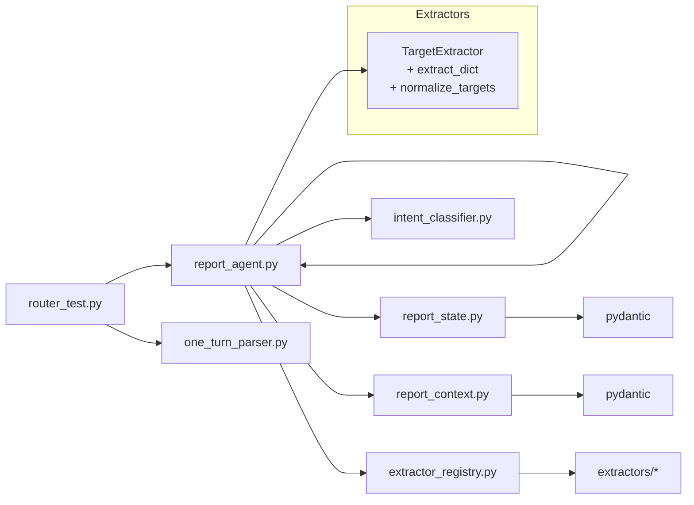

# Arborist Report Assistant — Project Status

## Files & Responsibilities

- **`report_agent.py`**
  - **Coordinator**: Orchestrates turns (routing utterances to intent, domain classification, extractors, or report services).
  - **Domain classifier**: Uses `classify_data_domains_llm` to map user text to one or more report-editable sections.

- **`models.py`**
  - **Extractor schemas**: Pydantic models for strict LLM-facing envelopes.
  - Enforces `extra="forbid"`, `NOT_PROVIDED`, and typed field structure.

- **`report_state.py`**
  - **Report state container**: Canonical in-memory object for a report.
  - **Pydantic models** for all report sections: tree_description, area_description, risks, recommendations, etc.
  - Tracks `provided_fields` for provenance and completeness checks.

- **`report_context.py`**
  - Context models for *non-editable info*: arborist, customer, job number, GPS coordinates.
  - Supplies stable metadata for inclusion in summaries/drafts.

- **`intent_llm.py`**
  - **Intent classifier**: Routes high-level intent → `PROVIDE_STATEMENT` vs `REQUEST_SERVICE`.
  - Provides the top-level decision that tells coordinator whether to extract data or pass request to a service stub.

- **`runners.py`**
  - **Harness for live testing**: runs phrases through the pipeline, compares outcomes to `EXPECTATIONS`.
  - Logs intent/domain verdicts, state snapshots, and overall pass/fail.

- **`test_data.py`**
  - Fixture phrases and expected intent/domain outcomes.
  - Drives `runners.py` verification loop.

## 2. Dependencies

- **Outlines** — structured prompting interface for extractors.
- **OpenAI** — LLM backend (default: gpt-4o-mini, configurable).
- **Pydantic** — strict schema validation (internal state + external envelopes).
- **Python stdlib** — `json`, `typing`, `argparse`, `datetime`.

---

## 3. What Works Well

- **Coordinator pipeline is solid**
  Utterance → Intent → Domain(s) → Extractors → State → Report Agent.

- **Domain classifiers & extractors function reliably**
  Each section extractor is strict, verbatim-only, and produces deterministic fields (`NOT_PROVIDED` vs populated).

- **State model is authoritative**
  All data flows into `report_state`, keeping provenance with `provided_fields`.

- **Context separation**
  Arborist/customer/location info is stable and isolated in `report_context`, not touched by extractors.

- **Coordinator + Router Test Harness**
  * Fully functional `router_test.py` with both **stub** and **spy** modes.
  * Logging of **state diffs** per utterance for transparent verification.

- **State Model (`ReportState`)**
  * Covers: `tree_description`, `area_description`, `targets`, `risks`, `recommendations`, plus context (`arborist_info`, `customer_info`, `location`).
  * Proven `model_merge_updates` pipeline, including provenance + `provided_fields` tracking.
  
- **Extractors**
  * **TreeDescriptionExtractor**: captures species, DBH, height, roots, defects, observations.
  * **RisksExtractor**: parses risk statements into `items`.
  * **TargetExtractor**: maps targets into structured `items` (`label`, `proximity_note`, etc.).
  * **AreaDescriptionExtractor**: basic site/context captures.
  * **RecommendationsExtractor**: captures removal/pruning/maintenance narratives.
  
- **Tests**
  * `router_spec.json` + harness demonstrate correct **intent classification**, **cursor movement**, **extractor invocation**, and **state updates**.
  * All 20 test utterances now **pass** in both stub and spy modes.

---

## 4 ⚠️ Issues Identified

1. **Risk items mis-parsing**

   * Extractor sometimes over-structures freeform sentences (`severity: "three dead"`).
   * **Desired behavior**: default to putting entire sentence in `description`; only parse likelihood/severity when explicitly labeled.
2. **Array overwrite vs append**

   * `risks.items` and `targets.items` are replaced each turn.
   * Decision required: should we **append** new items (keeping history) or **replace** (last-write)?
3. **Narratives overwrite**

   * `tree_description.defects` and `general_observations` are **strings**, so new utterances overwrite previous.
   * If we want accumulation, schema change needed (convert to lists) or concat with delimiter.
4. **Recommendations turn 19**

   * “remove to eliminate risk…” did not capture because `removal.narrative` already had a value.
   * Options: overwrite, or append to `recommendations.narratives`.
5. **Normalization**

   * Raw captures contain typographic quotes (`33”`) and unit strings (`65ft`).
   * Need post-merge normalization (quotes → ASCII, “65ft” → “65 ft”).
6. **Area lexicon**

   * Current “residential home” → `context: residential`, `site_use: home` works, but needs a deterministic lexicon to avoid drift.

---

## 5 🚀 Roadmap to Conversational Agent

### Phase 2.6 – Extraction & State Integrity

* [ ] **Fix RiskExtractor policy**: default to `description = sentence`.
* [ ] **Define array policy**:

  * If *append*: emit `existing_items + [new_item]`.
  * If *replace*: leave as is.
* [ ] **Update RecommendationsExtractor**: additional removal/prune utterances → `recommendations.narratives`.
* [ ] **Schema review**: consider converting `defects` & `general_observations` to **lists**.
* [ ] **Add normalizer**: run after merge to clean units and quotes.

### Phase 2 – Test Coverage Expansion

* [ ] Extend `router_spec.json` with additional utterances (multi-phrase, paraphrased, noisy input).
* [ ] Build dedicated **extractor eval spec** for precision/recall measurement.
* [ ] Add regression tests for “issues identified” fixes.

### Phase 3 – Conversational Behaviors

* [ ] **Service handling**:

  * Support “what’s left” → summarize missing/“Not provided” fields.
  * Support “summarize/draft/report” → structured summary generation.
  * Support Q\&A mode.
* [ ] **Repair prompts**:

  * If section identified but field not found → reply: *“I heard you describing the tree, but couldn’t capture the slot. Could you repeat that?”*
* [ ] **Meta-signals**: keep empty extractions (`Not Found`) in `provided_fields` for later repair.

### Phase 4 – User-Facing Agent

* [ ] Integrate coordinator with conversation loop (turns).
* [ ] Add persona scaffolding (polite error messages, confirmations).
* [ ] Pilot on real arborist transcripts.

---

## 📌 Next Actions

* Decide **append vs replace** policy for `risks.items` and `targets.items`.
* Decide on schema change for **string vs list** fields (`defects`, `observations`).
* Implement **post-merge normalization** layer.
* Update extractors per **Phase 1** tasks, then re-run spy tests to confirm.

